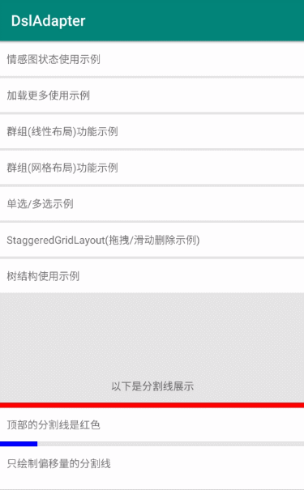
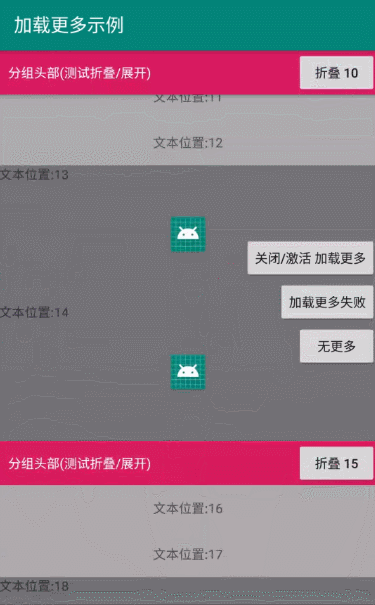
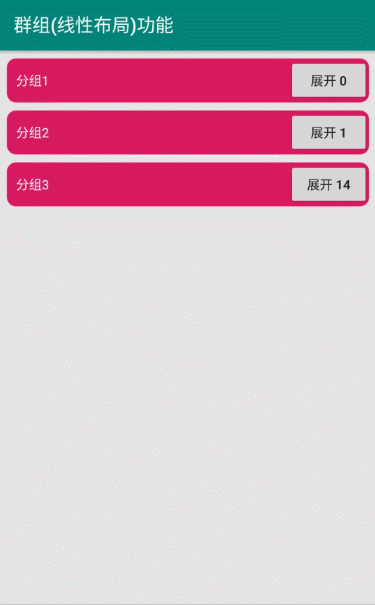
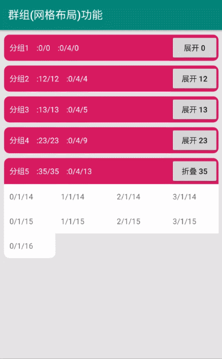
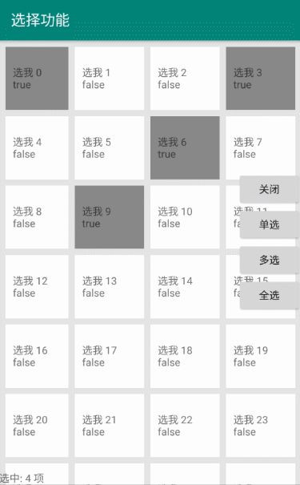
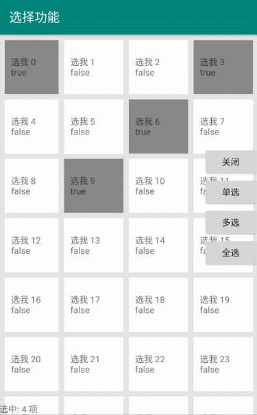
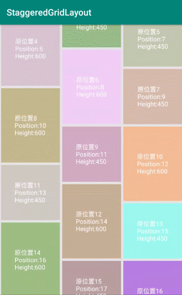
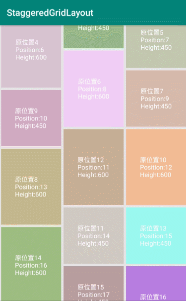
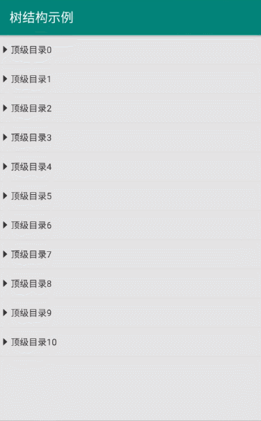
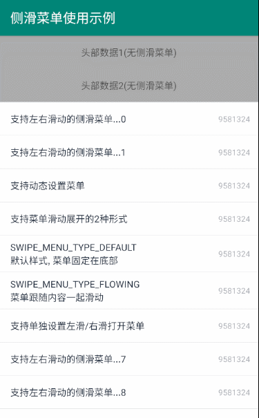

# DslAdapter

[](https://android-arsenal.com/api?level=12)   [](https://developer.android.google.cn/jetpack/androidx)  

     

`Kotlin`时代的`Adapter`.

`Dsl` 的形式使用 `RecyclerView.Adapter`, 支持情感图状态切换, 加载更多, 多类型`Item`等

[Gitee仓库地址](https://gitee.com/angcyo/DslAdapter)

[文档地址](https://angcyo.gitee.io/doc)

# 有何用?

只有一个目的`高效开发`, 一切都是为了`效率`.

可能以前写界面, 还在为了继承某个`xxActivity`or`xxFragment`, `xml`布局到底使用`xxLayout`而烦扰. 

有了`DslAdapter`, 一切皆是`RecyclerView`的天下.

你所能见到的`普通界面`,`列表界面`,`带滚动的界面`等等, 都可以使用`DslAdapter`轻松高效实现.

**注意:** 是`轻松高效实现`,`轻松高效实现`,`轻松高效实现`.

```kotlin
//普通界面渲染
dslAdapter.render {
    this + 普通1Item()
    this + 普通2Item()
    this + 普通3Item()
    ...
    底部普通Item()()
}

//列表界面渲染
dslAdapter.render {
    刷新指示器Item()()
    头部Item()()
    轮播图Item()()
    列表Item()()
    列表Item()()
    列表Item()()
    ...
    尾部Item()()
    加载更多Item()()
}

//普通界面和列表界面 如出一辙, 一点也不用惊讶,后面还有更刺激的.

//and so on
```

你没有看错, 就是这么`简单`, 就是这么`高效`. 一个字`...爽 爽 爽...`

任意界面, 都是由若干个`相同Item`or`不相同Item`组合而成.

**您所要做的就是:**

1. 将界面拆分成`若干个Item`
2. 继承`DslAdapterItem`实现对应的`Item`即可

> 魅力无极限, 期待您的表现.

# 特性
1. `全网最轻量`的`多类型Item`实现方法 (只需要关心`布局`+`逻辑`)
2. 支持`情感图状`态(空布局 加载中 错误异常等)切换,完美支持自定义扩展 (也是一个`Item`)
3. 支持`加载更多` 完美支持自定义扩展 (也是一个`Item`)
4. 支持分组`折叠` (类似QQ联系人好友分组,展开和折叠的效果) 
5. 支持Item`悬停` (类似QQ联系人好友分组,悬停的效果)
6. 支持常规的`分割线` (一会儿占满屏幕 一会儿有点边距的效果)
7. 支持单`选/多选` (支持固定选项)
8. 支持某一个Item更新时,`定向更新`多个其他Item (在表单编辑界面,很有用.)
9. 支持`群组`功能 (指定连续的几个相同/不同的item为一组)
10. 支持`滑动选择`(手指拖拽, 就可以选中范围内item)
11. 支持`拖拽排序` `侧滑删除` (注意不是侧滑菜单)
12. 支持`树结构`类似于`idea`中的文件列表目录结构 (支持异步加载)
13. 支持`左右侧滑菜单`(`2.4.0`后)
14. 支持`DataBinding`(`3.0.0`后)
15. 支持`ViewBinding`([参考示例](https://github.com/angcyo/DslAdapter/blob/master/Sample/src/main/java/com/angcyo/dsladapter/dsl/DslViewBindingItem.kt))
16. 支持`Item动画`(`4.3.0`后)
17. 支持将`DslAdapterItem`添加到任意`ViewGroup`中(`5.1.0`后)
18. 支持单独将`DslAdapterItem`的`itemBind`逻辑绑定在任意`View`中(`5.1.0`后)
19. 新增`IDslItem`,并支持自动初始化(`6.0.0`后 `minApi>=14`)

# 功能展示

[情感图切换](https://github.com/angcyo/DslAdapter/wiki/%E6%83%85%E6%84%9F%E5%9B%BE%E7%8A%B6%E6%80%81%E5%88%87%E6%8D%A2)|[加载更多](https://github.com/angcyo/DslAdapter/wiki/%E5%8A%A0%E8%BD%BD%E6%9B%B4%E5%A4%9A%E5%8A%9F%E8%83%BD)
:---:|:---:
|

[折叠展开](https://github.com/angcyo/DslAdapter/wiki/%E6%8A%98%E5%8F%A0%E5%92%8C%E5%B1%95%E5%BC%80) | [群组功能](https://github.com/angcyo/DslAdapter/wiki/%E7%BE%A4%E7%BB%84%E5%8A%9F%E8%83%BD)
:---:|:---:
|

[单选](https://github.com/angcyo/DslAdapter/wiki/%E5%8D%95%E9%80%89-%E5%A4%9A%E9%80%89-%E6%BB%91%E5%8A%A8%E9%80%89%E6%8B%A9)|[多选](https://github.com/angcyo/DslAdapter/wiki/%E6%8B%96%E6%8B%BD%E6%8E%92%E5%BA%8F%E5%92%8C%E4%BE%A7%E6%BB%91%E5%88%A0%E9%99%A4)
:---:|:---:
|

[滑动选择](https://github.com/angcyo/DslAdapter/wiki/%E5%8D%95%E9%80%89-%E5%A4%9A%E9%80%89-%E6%BB%91%E5%8A%A8%E9%80%89%E6%8B%A9)|[拖拽排序](https://github.com/angcyo/DslAdapter/wiki/%E6%8B%96%E6%8B%BD%E6%8E%92%E5%BA%8F%E5%92%8C%E4%BE%A7%E6%BB%91%E5%88%A0%E9%99%A4)
:---:|:---:
|

[侧滑删除](https://github.com/angcyo/DslAdapter/wiki/%E6%8B%96%E6%8B%BD%E6%8E%92%E5%BA%8F%E5%92%8C%E4%BE%A7%E6%BB%91%E5%88%A0%E9%99%A4)|[树结构](https://github.com/angcyo/DslAdapter/wiki/%E6%A0%91%E7%BB%93%E6%9E%84)
:---:|:---:
|

[侧滑菜单](https://github.com/angcyo/DslAdapter/wiki/%E4%BE%A7%E6%BB%91%E8%8F%9C%E5%8D%95)|[DslItem](https://github.com/angcyo/DslItem)
:---:|:---:
|

# 实战案例

多类型可复用内嵌`Item`|支持上下`Item`流的逻辑关联
:---:|:---:
|

IM界面也能完美胜任|可动态控制`Item`的表单界面
:---:|:---:
|

# 疑问

## 如何实现最后一个`Item`撑满`RecycleView`底部的剩余空间(如果有)?

需要自定义`ViewGroup`, 在`onLayout`方法中, 计算出`RecycleView`底部的剩余空间, 赋值给`LayoutParams`即可.

# 使用`JitPack`的方式, 引入库.

## 根目录中的 `build.gradle`

```kotlin
allprojects {
    repositories {
        ...
        maven { url 'https://jitpack.io' }
    }
}
```

## APP目录中的 `build.gradle`

```kotlin
dependencies {
    //androidx(推荐)
    implementation 'com.github.angcyo:DslAdapter:6.0.1'
    //支持DataBinding
    implementation 'com.github.angcyo:DslAdapter:3.0.0-binding'

    //support版请使用(不保证及时更新)
    implementation 'com.github.angcyo:DslAdapter:1.2.0'
    //跟随作者最新版请使用
    implementation 'com.github.angcyo:DslAdapter:master-SNAPSHOT'
}
```
发布的版本号,可以在这里查看. [点击查看](https://github.com/angcyo/DslAdapter/tags)

# 功能使用

请访问 [**WIKI文档**](https://github.com/angcyo/DslAdapter/wiki) 查看详情说明.

# 更新日志

[点击查看](https://github.com/angcyo/DslAdapter/blob/androidx/CHANGELOG.md)

# DslItem

正在整理的[DslItem](https://github.com/angcyo/DslItem)库, 囊括项目开发中能够见到的`Item`, 皆旨让开发更高效. 欢迎PR.

# 下载体验

扫码安装


# License

[](https://app.fossa.com/projects/git%2Bgithub.com%2Fangcyo%2FDslAdapter?ref=badge_large)

---
**群内有`各(pian)种(ni)各(jin)样(qun)`的大佬,等你来撩.**

# 联系作者

[点此QQ对话](http://wpa.qq.com/msgrd?v=3&uin=664738095&site=qq&menu=yes)  `该死的空格`    [点此快速加群](https://shang.qq.com/wpa/qunwpa?idkey=cbcf9a42faf2fe730b51004d33ac70863617e6999fce7daf43231f3cf2997460)

[开源地址](https://github.com/angcyo/DslAdapter)


# Stargazers over time

[](https://starchart.cc/angcyo/DslAdapter)

